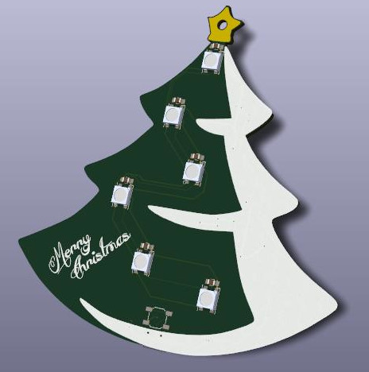
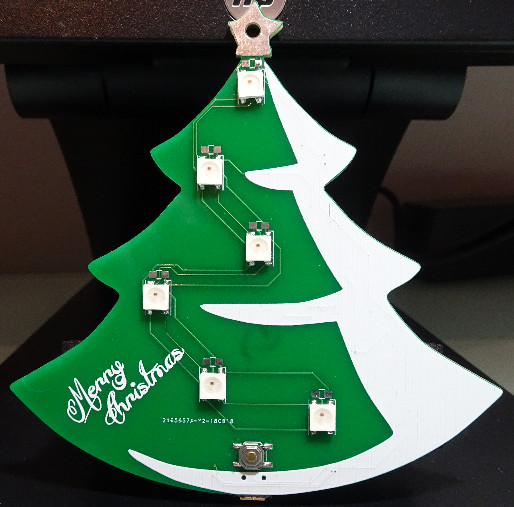
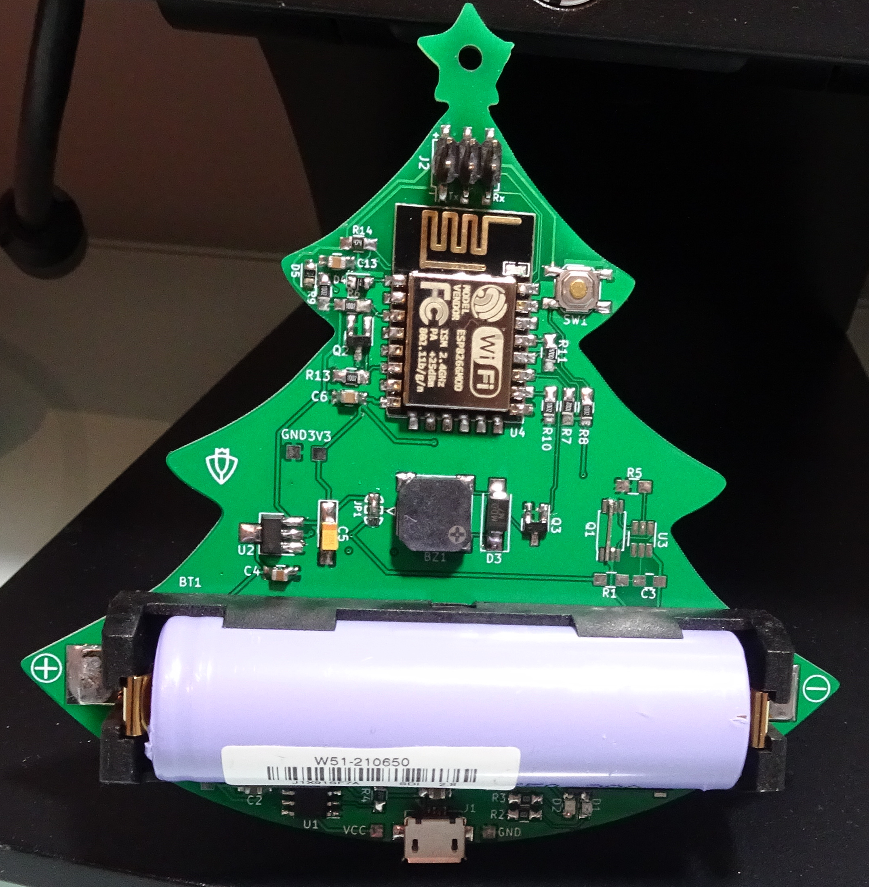

# Christmas-Ornaments
ESP8266 Christmas ornaments 

Based on this project:

	- Title:	ESP8266 Christmas Ornaments!
	- Author:	Sean Hodgins
	- Link:		https://www.instructables.com/id/ESP8266-Christmas-Ornaments/
	

FEATURES:

If front button of the ornament is pressed, a random song is played. Then, other ornaments plays a song too (within 5 min max.)

Every time the front button is pressed a counter in thinkSpesk.com is increased. Also, every 5 min. the counter is checked to know if a song must be played.

If the ornament could not reach a wifi AP, a captative portal is activated to configure a connection to different Wifi AP.

PICTURES:

	

TO IMPROVE:

Voltage regulator doesn't work if battery protection circuit is populated.

